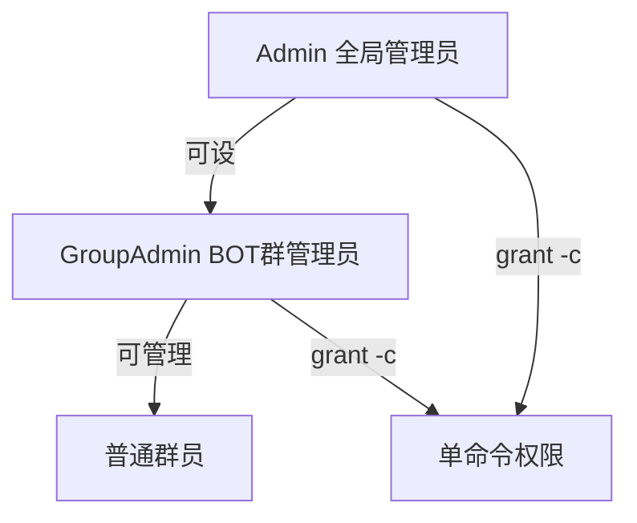

# 权限命令

`/grant`、`/enable`、`/disable`、`/silence`、`/admin` 用于管理命令权限和角色。

---

## `/grant` - 授予/撤销权限

| 默认权限 | 默认启用 | 可禁用 |
|---------|---------|--------|
| 群管理员 / BOT 管理员 | 是 | 否 |

### 授予命令权限

给指定 QQ 号使用某命令的权限：

```
/grant -c <命令> <QQ号>
```

例：给 QQ 123456 授予 `/watch` 权限：

```
/grant -c watch 123456
```

### 授予 BOT 群管理员角色

```
/grant -r GroupAdmin <QQ号>
```

!!! note "需要更高权限"
    触发命令的人必须本身已是 BOT 群管理员。

### 撤销权限

加 `-d` 即可撤销：

```
/grant -d -c watch 123456
```

**一句话：把 grant 命令复制过来，加 `-d` 即撤销。**

### 私聊版本

```
/grant -g 654321 -c watch 123456
```

---

## `/enable` 与 `/disable` - 启用/禁用命令

| 默认权限 | 默认启用 | 可禁用 |
|---------|---------|--------|
| BOT 群管理员 | 是 | 否 |

配套使用：`/disable` 禁用某命令，`/enable` 恢复。

### 禁用命令

```
/disable <命令>
```

例：禁用 watch（无法新增订阅，已有订阅仍正常推送）：

```
/disable watch
```

### 启用命令

```
/enable <命令>
```

例：

```
/enable watch
```

### 私聊版本

```
/disable -g 123456 watch
/enable -g 123456 watch
```

### 全局启用/禁用

管理员可全局启停命令（对所有群生效），见 [管理员命令](admin.md)：

```
/disable --global watch
/enable --global watch
```

!!! note "全局与单群的关系"
    全局禁用会覆盖所有群。假设命令 C 在 A 群禁用、B 群启用，全局禁用后 AB 群都不能用；再次全局启用后，仍保持 A 群禁用、B 群启用。

---

## `/silence` - 沉默模式

| 默认权限 | 默认启用 | 可禁用 |
|---------|---------|--------|
| BOT 群管理员 | 是 | 否 |

开启后**在群内**减少输出，不再显示：

- 命令权限不够
- 命令被禁用
- 命令语法错误（不含参数错误）
- 命令帮助（`-h`）

### 群内开启/关闭

```
/silence          # 开启
/silence -d       # 关闭
```

### 私聊设置（管理员）

管理员私聊可设置全局或指定群：

```
/silence                 # 全局开启
/silence -g 123456       # 对群 123456 开启
/silence -d              # 全局关闭
/silence -d -g 123456    # 关闭群 123456
```

!!! warning "新手不要急着开"
    不熟悉命令时开沉默模式，会看不到错误提示，反而更难排查。

---

## `/admin` - 查看管理员

| 默认权限 | 默认启用 | 可禁用 |
|---------|---------|--------|
| 所有人 | 是 | 否 |

查看当前拥有 Admin 权限的人：

```
/admin
```

在有权限的情况下，也能列出一个群内的 BOT 群管理员（GroupAdmin）。

---

## 权限体系

DDBOT 的权限分三层：



| 角色 | 获取方式 | 权限 |
|------|---------|------|
| Admin | `/whosyourdaddy`（仅无管理员时） | 所有命令 + 全局管理 |
| GroupAdmin | `/grant -r GroupAdmin <QQ>` | 群内管理命令 |
| 普通群员 | 默认 | 所有人可用的命令 |

---

## 下一步

- [管理员命令](admin.md) -- 全局管理命令
- [命令速查](index.md) -- 所有命令一览
- [配置命令](config-cmd.md) -- `/config`
