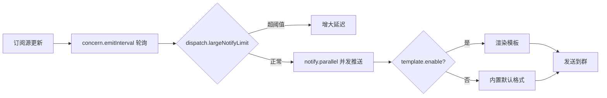

# 推送与模板开关

本页讲 `concern`、`dispatch`、`notify`、`template`、`autoreply`、`cronjob`、`customCommandPrefix` 这些配置。

---

## `concern` - 订阅刷新

```yaml
concern:
  emitInterval: 5s
```

| 字段 | 说明 |
|------|------|
| `emitInterval` | 订阅的刷新频率。`5s` 表示每 5 秒轮询一个订阅 ID |

!!! warning "不要太快"
    过快的刷新会导致 IP 被暂时封禁。保持默认 5s 即可。各订阅源还有自己的 `interval` 控制。

---

## `dispatch` - 巨量推送限流

```yaml
dispatch:
  largeNotifyLimit: 50
```

当一次推送需要发送到**超过 `largeNotifyLimit` 个群**时，DDBOT 会增大推送延迟，保证账号稳定。

默认 50。私人 bot 几乎不会触及，无需修改。

---

## `notify` - 推送并发

```yaml
notify:
  parallel: 1
```

推送消息的并发数。

| 值 | 说明 |
|----|------|
| `1`（默认） | 串行推送，优先保证账号稳定 |
| 更大值 | 出现推送堆积时可调高，加快消化速度 |

!!! tip "推送堆积时调高"
    如果订阅很多、推送经常积压，可尝试调到 2-3。但过高会增加风控风险。

---

## `template` - 模板开关

```yaml
template:
  enable: false
```

| 值 | 说明 |
|----|------|
| `false`（默认） | 不启用模板，使用内置默认格式 |
| `true` | 启用模板，自动创建 `template/` 目录，热重载自定义模板 |

启用后启动日志会显示「已启用模板」。

!!! tip "推荐启用"
    模板系统是 DDBOT 最强大的自定义能力，建议启用。详见 [模板系统](../template/index.md)。

---

## `autoreply` - 自定义命令

```yaml
autoreply:
  group:
    command: ["签到"]
  private:
    command: []
```

定义自定义命令，触发时发送对应模板内容。**需同时启用 `template: true`**。

| 字段 | 说明 |
|------|------|
| `group.command` | 群聊自定义命令列表 |
| `private.command` | 私聊自定义命令列表 |

例如上面配置了群命令 `签到`，触发 `/签到` 时会发送模板 `custom.command.group.签到.tmpl` 的内容。

详见 [自定义命令](../template/custom-command.md)。

---

## `cronjob` - 定时消息

```yaml
cronjob:
  - cron: "* * * * *"
    templateName: "定时1"
    target:
      private: [123]
      group: []
  - cron: "0 * * * *"
    templateName: "定时2"
    target:
      private: []
      group: [456]
```

定义定时消息，按 cron 表达式定时触发模板。

| 字段 | 说明 |
|------|------|
| `cron` | 5 字段 cron 表达式（分 时 日 月 周），最小粒度 1 分钟 |
| `templateName` | 模板名，对应 `custom.cronjob.<名字>.tmpl` |
| `target.private` | 私聊发送的 QQ 号列表 |
| `target.group` | 群聊发送的群号列表 |

!!! tip "cron 工具"
    可在 [tool.lu/crontab](https://tool.lu/crontab/)（选「类型：Linux」）编辑和测试 cron 表达式。

详见 [定时消息](../template/cronjob.md)。

---

## `customCommandPrefix` - 自定义命令前缀

```yaml
customCommandPrefix:
  签到: ""
  roll: "Q"
```

为特定命令重定义前缀，**优先级高于 `bot.commandPrefix`**。

| 配置 | 触发方式 |
|------|---------|
| `签到: ""` | 直接发「签到」即可触发（无前缀） |
| `roll: "Q"` | 发「Qroll」触发 |
| `help: "/"` | 发「/help」触发（默认前缀） |

!!! tip "支持留空前缀"
    `prefix` 支持留空，可搭配自定义命令实现无前缀触发。

### 注意事项

- 命令名不区分大小写（v0.3.6b 修复了小写失效问题）
- 多个命令可分别配置不同前缀
- 修改后**热重载**，无需重启

---

## 各项关系图



---

## 下一步

- [模板系统](../template/index.md) -- 启用模板后的完整用法
- [自定义命令](../template/custom-command.md) -- `autoreply` 详解
- [定时消息](../template/cronjob.md) -- `cronjob` 详解
- [命令手册](../commands/index.md) -- 命令前缀与触发
