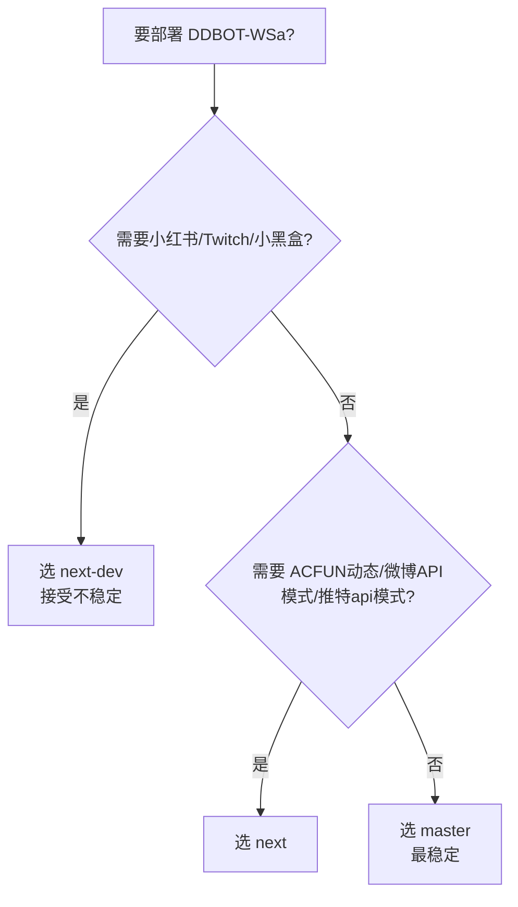

# 版本与分支

DDBOT-WSa 同时维护多个分支，功能与稳定性各有侧重。本页帮你选择适合自己的版本。

---

## 分支概览

| 分支 | 定位 | 稳定性 | 推荐场景 |
|------|------|--------|---------|
| **master** | 稳定分支，已验证功能 | 高 | 生产部署、新手使用 |
| **next** | 下一版候选，新功能 + 修复 | 中 | 尝鲜新功能、跟进开发 |
| **next-dev** | 开发分支，最前沿但不稳定 | 低 | 开发者、测试新订阅源 |

本文档站内容以 **master** 为准。`next` / `next-dev` 的新增内容见下文。

---

## master（稳定分支）

当前文档主要描述的版本。内置 9 个订阅源：

- B 站（live / news）
- 斗鱼、虎牙、ACFun、YouTube、微博、TwitCasting
- 推特（实验）、抖音（测试）

详见 [订阅源总览](../sources/index.md)。

---

## next 分支的新增内容

`next` 是 master 之后的候选版本，相对 master 的主要变化：

### 订阅源增强

- **ACFun 动态推送**：除了原有的直播推送，新增动态（news）类型，支持配置 ACFUN 账号（`account` / `password` / `authKey` / `acPassToken`）
- **微博重构**：
    - 改用 EmitQueue 按间隔轮询（不再用旧的 `fresh()` 机制）
    - 支持三种运行模式：`guest`（访客）/ `login`（登录）/ `api`（外部 API）
    - 新增 SUB 过期检测与自动 Cookie 恢复
    - 兼容微博访客 JSON 字段差异
- **推特增强**：
    - 支持两种模式：`mirror`（nitter 镜像，默认）/ `api`（Twitter API + cookie）
    - 修复无媒体、空回复推送等问题
    - 新增 `unsub` 配置
- **抖音**：重构已推送推文过滤，新增 `sessionId` cookie
- **B 站**：直播分区数据改为被动按需更新
- **YouTube**：新增模板支持（live / news 通知模板），Shorts 支持

### 框架改进

- **StateManager**：为 EmitQueue 添加站点级别的 `interval` 配置支持（每个订阅源可独立设间隔）
- **配置补全**：twitter、ACFun、TwitCasting 等配置字段及注释补全

### 配置差异（相对 master）

`next` 分支的 `application.yaml` 新增/变化字段：

```yaml
acfun:                  # 新增 ACFUN 账号配置
  account:
  password:
  authKey:
  acPassToken:
  unsub: false
  interval: 25s
  onlyOnlineNotify: false

twitter:                # 新增 mode 选择
  mode: mirror          # mirror / api
  unsub: false
  # api 模式额外字段：
  auth_token:
  ct0:
  bearerToken:
  queryId:
  screenName:

douyin:                 # 新增 sessionId
  acSignature:
  acNonce:
  sessionId:
  userAgent:
  interval: 30s

weibo:                  # 完全重构
  mode: guest           # guest / login / api
  sub:
  qrlogin: true
  autorefresh: false
  apiModeBaseURL: "http://127.0.0.1:5000"
  snapcastURL: ""
  disableCookieAlert: false
  alertGroupId: 0
```

---

## next-dev 分支的新增内容

`next-dev` 是最前沿的开发分支，包含 `next` 的全部内容，并额外新增：

### 新增订阅源

| 订阅源 | site | 类型 | 说明 |
|--------|------|------|------|
| **小红书** | `xhs` | live / news | 需配置 cookies（a1 等），含加密模块 |
| **Twitch** | `twitch` | live | 需注册 Twitch 应用获取 clientId/clientSecret |
| **小黑盒** | `heybox`（代码内 `xhh`） | news | 自动生成 smidV2，无需配置 |

### 框架级变化

- **适配器抽象**：新增 `adapter` 配置，默认 `onebot-v11`，为未来支持更多协议预留
- **Telegram 推送**：支持把推送同步到 Telegram（`telegram.enable`）
- **管理后台**：新增 `admin` HTTP 管理接口（`admin.addr` / `admin.token`）
- **扩展数据库**：新增 `extDb`，可选独立于 `.lsp.db` 的扩展数据库
- **YouTube Shorts 支持**：新增 Shorts 推送，带配置加固和测试
- **微博移动端 API**：新增移动端 API 响应 proto 定义及转换
- **模板兼容性修复**：`adapter.SenderInfo.Uin` 字段保留为 `UserID` 的别名，老模板无需修改

### next-dev 配置示例

```yaml
xhs:                    # 小红书
  cookies:
    a1: ""
    web_session: ""
    webId: ""
  interval: 15s
  onlyOnlineNotify: false

twitch:                 # Twitch
  clientId:
  clientSecret:
  interval: 30s
  onlyOnlineNotify: false

heybox:                 # 小黑盒
  x_xhh_tokenid:        # 可选，未配置时自动生成
  interval: 30s
  onlyOnlineNotify: false

adapter:
  mode: onebot-v11

admin:
  enable: false
  addr: "127.0.0.1:15631"
  token: ""

extDb:
  enable: false
  path: ".ext.db"

telegram:
  enable: false
  token: ""
  proxy:
    enable: false
    url: ""
  endpoint: ""
```

---

## 如何选择



### 建议

- **新手 / 生产环境**：用 **master**，配合本文档
- **想用微博 API 模式、ACFUN 动态、推特 API 模式**：用 **next**
- **需要小红书 / Twitch / 小黑盒 / Telegram 推送**：用 **next-dev**，但要做好遇到 bug 的准备

---

## 切换分支

下载预编译版本时，在 [Releases](https://github.com/cnxysoft/DDBOT-WSa/releases) 选择对应分支的构建产物。

从源码编译：

```bash
# master
git clone -b master https://github.com/cnxysoft/DDBOT-WSa.git

# next
git clone -b next https://github.com/cnxysoft/DDBOT-WSa.git

# next-dev
git clone -b next-dev https://github.com/cnxysoft/DDBOT-WSa.git

cd DDBOT-WSa
make build
```

!!! warning "分支间不保证配置兼容"
    `next` / `next-dev` 的 `application.yaml` 字段比 master 多，从 master 升级到 next 时，新增字段按需添加即可（不填用默认值）。但从 next-dev 降回 master 可能丢失部分配置。

---

## 订阅源差异对照

| 订阅源 | master | next | next-dev |
|--------|:------:|:----:|:--------:|
| B 站 | ✅ | ✅ 分区按需更新 | ✅ |
| 斗鱼 | ✅ | ✅ | ✅ |
| 虎牙 | ✅ | ✅ | ✅ |
| ACFun | 直播 | 直播 + 动态 | 直播 + 动态 |
| YouTube | ✅ | ✅ 模板 + Shorts | ✅ Shorts 加固 |
| 微博 | ✅ 游客 | ✅ 三模式 + 告警 | ✅ 移动端 API |
| TwitCasting | ✅ | ✅ | ✅ |
| 推特 | ✅ mirror | ✅ mirror + api | ✅ |
| 抖音 | ✅ | ✅ + sessionId | ✅ |
| 小红书 | ❌ | ❌ | ✅ |
| Twitch | ❌ | ❌ | ✅ |
| 小黑盒 | ❌ | ❌ | ✅ |

---

## 下一步

- [订阅源总览](../sources/index.md) - master 分支的订阅源说明
- [配置参考](../config/index.md) - master 配置字段
- [更新日志](../changelog.md) - 版本更新记录
