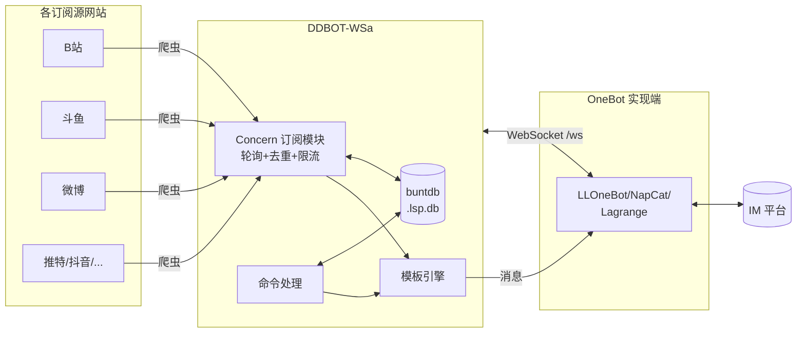

# 了解 DDBOT

在动手部署之前，花 3 分钟了解 DDBOT 的定位、历史和架构，能帮你少走很多弯路。

---

## DDBOT 是什么

DDBOT 是一个 **消息推送框架**，由 [Sora233](https://github.com/Sora233/DDBOT) 开发。它把「某个网站有更新」这件事，转化成「在 IM 群里发一条消息」。

典型场景：

- 你关注的 B 站 UP 主开播了 → BOT 在群里喊一声
- 你关注的微博博主发动态了 → BOT 把内容搬到群里
- 你关注的油管频道更新了 → BOT 推送视频链接

**它不是聊天机器人。** DDBOT 被刻意设计成最小交互：只在「订阅对象有更新」和「答复命令」时主动发言，正常聊天永远不会误触它。

---

## DDBOT-WSa 是什么

DDBOT 经历了三次主要演进：

| 分支 | 维护者 | 关键变化 |
|------|--------|---------|
| **DDBOT**（纯血） | Sora233 | 基于 MiraiGo，直接走 QQ 协议（MiraiGo 失效，已不可用） |
| DDBOT-ws | Hoshinonyaruko | 改为接入 OneBot 协议，去掉对 MiraiGo 登录的依赖 |
| **DDBOT-WSa** | cnxysoft | 在 ws 基础上恢复 DDBOT 原有功能 + 接入 OneBot 11 |

DDBOT-WSa 的核心定位：

> 基于 DDBOT-ws 的修改版本，目的是恢复 DDBOT 的原有功能。兼容 LLOnebot / NapCat / Lagrange 等 OneBot 11 实现端。

### 为什么不直接登录 IM

直接走 IM 协议（纯血 DDBOT 走 QQ 协议的方式）有几个痛点：

- 需要维护签名服务器（sign-server），否则容易登录失败或被风控
- 协议变动频繁，登录代码需要持续跟进
- 设备锁、滑块验证等人工干预多
- 纯血 DDBOT 依赖的 MiraiGo 已失效，无法登录 QQ

改用 **OneBot 协议**后，登录 IM 这件事交给专门的实现端（LLOneBot / NapCat / Lagrange 等，它们各自跟进 IM 协议），DDBOT 只负责：

- 订阅管理（谁订阅了谁的什么）
- 爬虫轮询（定时去各网站抓更新）
- 消息组装（把更新变成 IM 消息）
- 命令处理（解析 `/watch` 等命令）
- 推送调度（限流、去重、@、模板渲染）

两者通过 WebSocket 通信，职责清晰，互不干扰。OneBot 是一套通用规范，理论上任何支持该协议的 IM 平台都能接入，QQ 只是当前最主流的实现目标。

---

## 整体架构

几个关键点：

- **`lsp` 包**是框架核心，包含订阅管理、命令处理、模板引擎、事件分发
- **`concern` 包**是订阅抽象，每个订阅源（B 站、微博等）实现 `Concern` 接口注册进来
- **`buntdb`** 是嵌入式 KV 数据库，文件 `.lsp.db`，存储所有订阅、权限、配置
- **WebSocket** 是 DDBOT 与 OneBot 实现端之间的唯一通道，地址默认 `ws://127.0.0.1:15630/ws`

---

## 核心概念

| 概念 | 含义 |
|------|------|
| **site** | 订阅网站，如 `bilibili` / `weibo` / `twitter` |
| **type** | 订阅类型，如 B 站的 `live`（直播）/ `news`（动态） |
| **id** | 订阅对象的唯一标识，如 B 站 UID、斗鱼房间号 |
| **Concern** | 一个完整的订阅模块（网站 + 类型 + 爬虫 + 状态管理） |
| **Notify** | 一次推送事件（谁、在哪、推什么） |
| **模板** | `.tmpl` 文件，控制推送/命令/事件的输出格式 |

---

## 功能概览

- **直播/动态推送**：B 站、斗鱼、虎牙、ACFun、YouTube、微博、TwitCasting、推特、抖音
- **过滤控制**：按关键字、动态类型过滤；@全体或指定人；下播/标题变更提醒；防刷屏去重
- **权限管理**：命令启用/禁用、单用户命令权限、角色权限
- **模板系统**：自定义所有输出格式、自定义命令回复、定时消息（cron）
- **插件扩展**：实现 `Concern` 接口即可接入任意订阅源

---

## 设计理念

> 制作 bot 的本意是为了减轻一些重复的工作负担，bot 只会做好 bot 份内的工作。

- 交互被刻意设计成最小程度，正常交流时永远不必担心误触
- 只在两种情况主动发言：更新动态/直播，以及答复命令结果
- 私聊命令可避免群内刷屏，绝大多数管理操作都能私聊完成

---

## 下一步

- [安装](install.md) -- 下载或编译 DDBOT
- [首次配置](first-config.md) -- 生成配置文件、设置管理员
- [连接 OneBot](connect/index.md) -- 对接你的实现端
- [版本与分支](branches.md) -- master / next / next-dev 的差异与选择
