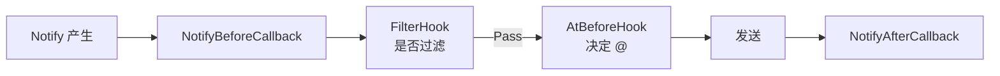

# 配置钩子

每个「群 × 订阅 id」可独立配置推送行为（@、过滤、推送开关）。插件可重写 `GroupConcernConfig` 注入自定义逻辑。

---

## Hook 链

推送时框架会依次调用一系列 Hook：



| Hook | 作用 | 返回 |
|------|------|------|
| `NotifyBeforeCallback` | 发送前回调，可修改 notify 状态 | - |
| `FilterHook` | 是否过滤本次推送 | `HookResult`（Pass/Reason） |
| `AtBeforeHook` | 决定是否 @、@谁 | `HookResult` |
| `NotifyAfterCallback` | 发送后回调，可缓存消息 | - |

---

## 自定义 GroupConcernConfig

重写 `GetGroupConcernConfig`，返回自己的 config 类型：

```go
type GroupConcernConfig struct {
    concern.IConfig
    concern *Concern
}

func (g *GroupConcernConfig) FilterHook(notify concern.Notify) *concern.HookResult {
    hook := new(concern.HookResult)
    // 自定义过滤逻辑
    if shouldFilter(notify) {
        hook.Reason = "filtered by my rule"
        return hook
    }
    hook.Pass = true
    return hook
}

func NewGroupConcernConfig(g concern.IConfig, c *Concern) *GroupConcernConfig {
    return &GroupConcernConfig{g, c}
}
```

在 StateManager 上重写：

```go
func (s *StateManager) GetGroupConcernConfig(groupCode int64, id interface{}) concern.IConfig {
    return NewGroupConcernConfig(s.StateManager.GetGroupConcernConfig(groupCode, id), s.concern)
}
```

---

## HookResult

```go
type HookResult struct {
    Pass   bool
    Reason string
}
```

- `Pass = true` - 放行
- `Pass = false` - 拦截，`Reason` 会记录到日志

---

## 内置配置项

`IConfig` 已实现了这些配置（用户通过 `/config` 命令设置）：

### @相关（`config_at.go`）

- `CheckAtAll(type)` - 是否开启了 @全体
- `GetAtSomeoneList(type)` - 要 @的 QQ 号列表
- `AddAt` / `RemoveAt` - 增删 @成员

### 过滤（`config_filter.go`）

- `Empty()` - 是否未设过滤
- `Type` - 过滤类型（`FilterTypeType`/`FilterTypeNotType`/`FilterTypeText`）
- `GetFilterByType()` - 获取类型过滤配置

### 推送开关（`config_notify.go`）

- 标题变更推送
- 下播推送

你的 `FilterHook` 可基于这些配置决定是否放行。

---

## 范本：B 站动态过滤

参考 `lsp/bilibili/config.go` 的 `FilterHook`：

```go
func (g *GroupConcernConfig) FilterHook(notify concern.Notify) *concern.HookResult {
    hook = new(concern.HookResult)
    switch n := notify.(type) {
    case *ConcernLiveNotify:
        hook.Pass = true
        return
    case *ConcernNewsNotify:
        if g.GetGroupConcernFilter().Empty() {
            hook.Pass = true
            return
        }
        // 按类型过滤
        switch g.GetGroupConcernFilter().Type {
        case concern.FilterTypeType, concern.FilterTypeNotType:
            // 检查动态类型是否匹配
            // ...
        }
    }
    return
}
```

---

## NotifyBeforeCallback 示例

B 站用它在发送前设置 compactKey（联合投稿去重）：

```go
func (g *GroupConcernConfig) NotifyBeforeCallback(inotify concern.Notify) {
    if inotify.Type() != News {
        return
    }
    notify := inotify.(*ConcernNewsNotify)
    notify.compactKey = notify.Card.GetDesc().GetBvid()
    err := g.concern.SetGroupCompactMarkIfNotExist(notify.GetGroupCode(), notify.compactKey)
    if localdb.IsRollback(err) {
        notify.shouldCompact = true  // 已存在，简化推送
    }
}
```

---

## NotifyAfterCallback 示例

发送后缓存消息，用于下次回复：

```go
func (g *GroupConcernConfig) NotifyAfterCallback(inotify concern.Notify, msg *message.GroupMessage) {
    if msg == nil || msg.Id == -1 {
        return
    }
    notify := inotify.(*ConcernNewsNotify)
    if len(notify.compactKey) == 0 {
        return
    }
    g.concern.SetNotifyMsg(notify.compactKey, msg)  // 缓存
}
```

---

## AtBeforeHook

控制是否 @。B 站用它阻止「不安全启动状态」下 @：

```go
func (g *GroupConcernConfig) AtBeforeHook(notify concern.Notify) *concern.HookResult {
    hook := new(concern.HookResult)
    if g.concern != nil && g.concern.unsafeStart.Load() {
        hook.Reason = "unsafe start status"
        return hook
    }
    return g.IConfig.AtBeforeHook(notify)
}
```

---

## 下一步

- [keyset 与注册](keyset-register.md) - 注册与 key 规范
- [完整范本](example-walkthrough.md) - 真实实现走查
- [StateManager](statemanager.md) - 状态管理
