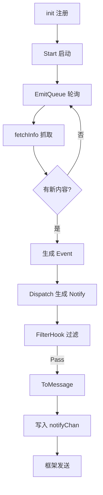

# 完整范本走查

本页以 DDBOT-WSa 内置的 **推特** 和 **抖音** 订阅源为范本，走查一个完整订阅源的实现。它们是较新的实现，结构清晰，适合作为参考。

---

## 目录结构

以推特为例（`lsp/twitter/`）：

```
lsp/twitter/
├── init.go          # 注册 Concern + cookie 初始化
├── concern.go       # 实现 Concern 接口 + StateManager
├── config.go        # GroupConcernConfig（自定义 Hook）
├── extraKey.go      # 数据库 key 封装
├── fetchInfo.go     # 爬虫：抓取推文
├── notify.go        # Notify 实现：转成消息
├── model.go         # 数据结构
└── model_test.go    # 测试
```

---

## 1. init.go - 注册

```go
package twitter

import (
    "github.com/Sora233/MiraiGo-Template/config"
    "net/http/cookiejar"
    "github.com/cnxysoft/DDBOT-WSa/lsp/concern"
)

var (
    BaseURL   = []string{"https://lightbrd.com/", "https://nitter.net/"}
    UserAgent = "Mozilla/5.0 ..."
)

func init() {
    concern.RegisterConcern(newConcern(concern.GetNotifyChan()))
}

func setCookies() {
    ua := config.GlobalConfig.GetString("twitter.userAgent")
    url := config.GlobalConfig.GetStringSlice("twitter.BaseUrl")
    Cookie, _ = cookiejar.New(nil)
    if ua != "" {
        UserAgent = ua
    }
    if len(url) > 0 {
        BaseURL = url
    }
}
```

要点：

- `init()` 里注册，传入 `concern.GetNotifyChan()`
- 从 `config.GlobalConfig` 读取配置
- 初始化 cookie jar

---

## 2. concern.go - Concern 与 StateManager

```go
type StateManager struct {
    *concern.StateManager
    *ExtraKey
    concern *twitterConcern
}

type twitterConcern struct {
    *StateManager
    notify chan<- concern.Notify
}

const (
    Site   = "twitter"
    Tweets concern_type.Type = "news"
)

func (c *twitterConcern) Site() string { return Site }

func (c *twitterConcern) Types() []concern_type.Type {
    return []concern_type.Type{Tweets}
}

func (c *twitterConcern) ParseId(s string) (interface{}, error) {
    return s, nil  // 用户名是 string
}

func (c *twitterConcern) GetStateManager() concern.IStateManager {
    return c.StateManager
}
```

要点：

- 嵌入 `concern.StateManager` 和 `ExtraKey`
- `Site()` 返回唯一标识
- `Types()` 返回支持的类型
- `ParseId` 决定 id 类型（string/int64）

---

## 3. config.go - 自定义 Hook

```go
type GroupConcernConfig struct {
    concern.IConfig
    concern *twitterConcern
}

func (g *GroupConcernConfig) FilterHook(notify concern.Notify) *concern.HookResult {
    // 自定义过滤逻辑
    return concern.HookResultPass
}

func (t *StateManager) GetGroupConcernConfig(groupCode int64, id interface{}) concern.IConfig {
    return NewGroupConcernConfig(t.StateManager.GetGroupConcernConfig(groupCode, id), t.concern)
}
```

重写 `GetGroupConcernConfig` 注入自己的 config 类型，实现自定义过滤/推送逻辑。

---

## 4. extraKey.go - key 封装

```go
type ExtraKey struct{}

func (e *ExtraKey) UserInfoKey(id interface{}) string {
    return fmt.Sprintf("twitter:userinfo:%v", id)
}
```

把 key 生成逻辑封装在 `ExtraKey` 里，StateManager 嵌入后可直接用 `s.UserInfoKey(id)`。

---

## 5. fetchInfo.go - 爬虫

实现 `FreshFunc`，轮询时调用：

```go
func (c *twitterConcern) fetchTweets(screenName string) ([]concern.Event, error) {
    // 1. 构建 URL（从 BaseURL 随机选一个镜像）
    url := buildProfileURL(screenName)
    // 2. 请求页面
    resp, err := requests.Get(url.String(), ...)
    // 3. 解析 HTML，提取推文
    events := parseTweets(resp)
    return events, nil
}
```

启用 EmitQueue：

```go
s.UseEmitQueue()
s.UseFreshFunc(s.EmitQueueFresher(func(p concern_type.Type, id interface{}) ([]concern.Event, error) {
    return c.fetchTweets(id.(string))
}))
```

---

## 6. notify.go - Notify 实现

```go
type TwitterNotify struct {
    *TwitterEvent
    GroupCode int64
}

func (n *TwitterNotify) GetGroupCode() int64 {
    return n.GroupCode
}

func (n *TwitterNotify) ToMessage() *mmsg.MSG {
    m := mmsg.NewMSG()
    m.Textf("%s 发了新推文\n", n.UserName)
    m.Text(n.Content)
    for _, img := range n.Images {
        m.ImageByUrl(img)
    }
    if n.VideoUrl != "" {
        // m3u8 视频，需 ffmpeg
        m.Video(n.VideoUrl)
    }
    return m
}
```

`ToMessage()` 把事件转成 `mmsg.MSG`，框架负责发送。

---

## 抖音范本要点

抖音（`lsp/douyin/`）结构类似，但有以下差异：

### cookie 与人机验证

```go
func init() {
    concern.RegisterConcern(NewConcern(concern.GetNotifyChan()))
}

func setCookies() {
    as := config.GlobalConfig.GetString("douyin.acSignature")
    an := config.GlobalConfig.GetString("douyin.acNonce")
    if as == "" || an == "" {
        Stop = true  // 没配 cookie 则不启动
    }
}
```

无 cookie 时设置 `Stop = true`，订阅模块不启动。

### 检测人机验证

```go
func (c *douyinConcern) checkLive(id interface{}) {
    if Stop {
        return  // 已停止
    }
    // 请求接口
    resp, err := checkUserLiveStatus(id)
    if isHumanVerification(resp) {
        // 触发人机验证，推送提示
        c.notify <- &DouyinVerifyNotify{...}
        return
    }
    // ...
}
```

---

## 完整流程



---

## 参考实现

| 订阅源 | 路径 | 特点 |
|--------|------|------|
| 推特 | `lsp/twitter/` | nitter 镜像、m3u8 视频 |
| 抖音 | `lsp/douyin/` | cookie 人机验证 |
| B 站 | `lsp/bilibili/` | 最完整，关注机制、动态过滤、专栏解析 |
| 微博 | `lsp/weibo/` | 游客 cookie 自动刷新 |
| YouTube | `lsp/youtube/` | 新老 ID 兼容 |

建议从推特/抖音入手（结构最清晰），有疑问再看 B 站的复杂实现。

---

## 下一步

- [插件开发首页](index.md) - 回到起点
- [Concern 接口](concern-interface.md)
- [DDBOT-example](https://github.com/Sora233/DDBOT-example) - 最小示例
- [GoDoc](https://pkg.go.dev/github.com/cnxysoft/DDBOT-WSa) - API 文档
