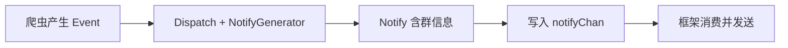

# 插件开发快速开始

DDBOT 是一个通用推送框架，你可以通过编写插件接入任意订阅源。本页帮你快速上手。

!!! info "需要 Go 开发能力"
    插件开发需要会 Go 语言。如果你只想使用现成的订阅源，可以跳过本章节。

---

## 基本步骤

为 DDBOT 编写插件的三步：

1. 通过 `concern.StateManager`，实现 `concern.Concern` 接口
2. 在 `init()` 函数中注册
3. 在 `main` 中引入插件包

---

## 脚手架与示例

DDBOT 提供了脚手架和示例，建议从它们开始：

- **[DDBOT-template](https://github.com/Sora233/DDBOT-template)** - 插件脚手架，快速创建插件模板（原版，Sora233 维护）
- **[DDBOT-example](https://github.com/Sora233/DDBOT-example)** - 示例插件，展示完整写法（原版，Sora233 维护）

!!! note "关于脚手架仓库"
    原文档提到的 `cnxysoft/DDBOT-WSa-template` 与 `cnxysoft/DDBOT-WSa-example` 仓库目前不存在，请使用上面 Sora233 维护的原版脚手架。两者 API 兼容，可直接用于 DDBOT-WSa。

### 使用脚手架

```bash
# 克隆脚手架
git clone https://github.com/Sora233/DDBOT-template.git my-ddbot-plugin
cd my-ddbot-plugin

# 修改 go.mod 里的 module 名
# 编辑插件代码
```

### 引入插件

在你的 `main.go` 中引入插件包：

```go
import (
    _ "github.com/yourname/my-ddbot-plugin/concern"
)
```

引入后，插件会在 `init()` 时自动注册到 DDBOT。

---

## 最小示例

example 插件为网站 `example` 新增了类型 `example`：

```go
package concern

import (
    "github.com/cnxysoft/DDBOT-WSa/lsp/concern"
    "github.com/cnxysoft/DDBOT-WSa/lsp/concern_type"
)

const Site = "example"
const ExampleType concern_type.Type = "example"

func init() {
    concern.RegisterConcern(newConcern(concern.GetNotifyChan()))
}
```

订阅命令：

```
/watch -s example -t example <ID>
/unwatch -s example -t example <ID>
/list
```

---

## 插件结构

一个完整的订阅源插件通常包含以下文件：

| 文件 | 作用 |
|------|------|
| `init.go` | 注册 Concern，初始化 cookie/配置 |
| `concern.go` | 实现 `Concern` 接口 |
| `stateManager.go` | 状态管理，继承 `concern.StateManager` |
| `config.go` | `GroupConcernConfig`，自定义 Hook |
| `keyset.go` | 数据库 key 定义 |
| `model.go` | 数据结构 |
| `notify.go` | Notify 实现（可选，也可合并在 concern.go） |
| `fetchInfo.go` 等 | 爬虫逻辑 |

可参考内置订阅源 `lsp/twitter/`、`lsp/douyin/`（较新，结构清晰）作为范本。

---

## 核心概念



| 概念 | 说明 |
|------|------|
| **Event** | 订阅对象的行为（发动态、开播），不含接收方信息 |
| **Notify** | Event + 群信息，可转成消息 |
| **Concern** | 一个完整订阅模块（网站+类型+爬虫+状态管理） |
| **StateManager** | 管理订阅状态、配置、缓存 |

---

## 下一步

按顺序阅读：

1. [Concern 接口](concern-interface.md) - 实现 `Concern` 接口
2. [StateManager](statemanager.md) - 状态管理与轮询
3. [持久化](persistence.md) - buntdb 数据存储
4. [配置钩子](config-hook.md) - 自定义推送过滤逻辑
5. [keyset 与注册](keyset-register.md) - 数据库 key 与注册
6. [完整范本](example-walkthrough.md) - Twitter/抖音实现走查

---

## 参考资源

- [GoDoc](https://pkg.go.dev/github.com/cnxysoft/DDBOT-WSa) - API 文档
- [DDBOT-template](https://github.com/Sora233/DDBOT-template) - 脚手架
- [DDBOT-example](https://github.com/Sora233/DDBOT-example) - 示例
- [B 站专栏介绍](https://www.bilibili.com/read/cv10602230)
