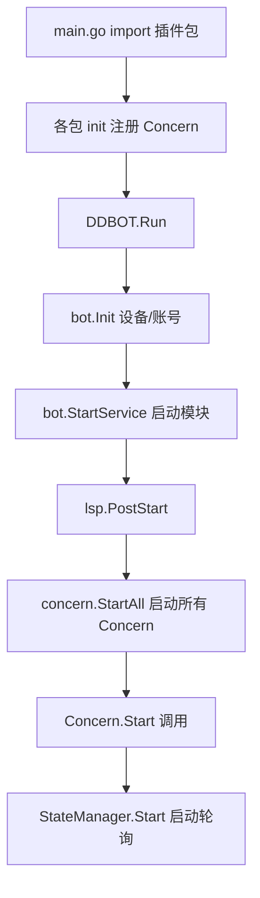

# keyset 与注册

本页讲数据库 key 的规范和 Concern 的注册机制。

---

## 注册 Concern

在插件包的 `init()` 中调用 `RegisterConcern`：

```go
package example

import "github.com/cnxysoft/DDBOT-WSa/lsp/concern"

func init() {
    concern.RegisterConcern(NewConcern(concern.GetNotifyChan()))
}
```

### 注册时会校验

`RegisterConcern` 会检查：

- `Site()` 全局唯一，重复注册会 panic
- 每个 `Type` 的 `IsTrivial()` 必须为 true
- `Types()` 不能为空

### 在 main 中引入

```go
package main

import (
    "github.com/cnxysoft/DDBOT-WSa"
    _ "github.com/yourname/my-plugin/concern"  // 触发 init
)

func main() {
    DDBOT.Run()
}
```

`_` 表示只执行包的 `init()`，不直接引用。引入后插件自动注册。

---

## key 规范

所有插件共用一个 `.lsp.db`，key **必须带唯一前缀**，避免冲突。

### 命名约定

```
<site>:<用途>:<标识>
```

示例：

| key | 含义 |
|-----|------|
| `bilibili:userinfo:97505` | B 站用户信息 |
| `bilibili:attention_list` | B 站关注列表缓存 |
| `twitter:userinfo:elonmusk` | 推特用户信息 |
| `weibo:cookie:visitor` | 微博游客 cookie |

### keyset 文件

参考 `lsp/bilibili/keyset.go`：

```go
package bilibili

const (
    keyPrefix        = "bilibili"
    KeyUserInfo      = keyPrefix + ":userinfo:"
    KeyAttentionList = keyPrefix + ":attention_list"
    KeyCompactMark   = keyPrefix + ":compact:"
)

// 封装成函数
func userInfoKey(id int64) string {
    return fmt.Sprintf("%s%d", KeyUserInfo, id)
}

func compactKey(groupCode int64, id interface{}) string {
    return fmt.Sprintf("%s%d:%v", KeyCompactMark, groupCode, id)
}
```

### extraKey 模式

推特/抖音用 `extraKey` 结构体封装：

```go
// lsp/twitter/extraKey.go
type ExtraKey struct{}

func (e *ExtraKey) UserInfoKey(id interface{}) string {
    return fmt.Sprintf("twitter:userinfo:%v", id)
}
```

然后在 StateManager 嵌入：

```go
type StateManager struct {
    *concern.StateManager
    *ExtraKey
}
```

---

## 内置 key 工具

`lsp/buntdb/key.go` 提供 `Key()` 函数生成标准 key：

```go
import localdb "github.com/cnxysoft/DDBOT-WSa/lsp/buntdb"

key := localdb.Key("OnGroupMemberJoined", groupCode, uin, joinTime)
localdb.Set(key, "", localdb.SetExpireOpt(time.Minute*2))
```

`Key()` 会把各部分用分隔符拼起来。

---

## 全局 key

部分 key 是框架级的，插件不应使用这些前缀：

| 前缀 | 用途 |
|------|------|
| `lsp:` | 框架自身状态 |
| `permission:` | 权限数据 |
| `version:` | 版本号 |
| `ddbot:` | 框架配置 |

---

## 启动顺序



- 各插件的 `init()` 在 import 时执行
- `concern.StartAll()` 在 `PostStart` 时统一启动所有注册的 Concern
- 启动失败的 Concern 会被剔除，不影响其他

---

## 下一步

- [完整范本](example-walkthrough.md) - 真实实现走查
- [Concern 接口](concern-interface.md)
- [配置钩子](config-hook.md)
