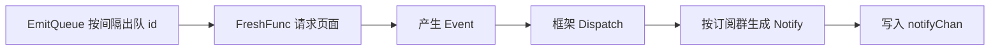

# StateManager

`StateManager` 管理订阅状态、配置、缓存、轮询。插件通过继承 `concern.StateManager` 复用大部分能力。

---

## 创建 StateManager

```go
type StateManager struct {
    *concern.StateManager
    // 可加自己的扩展字段
}

func NewStateManager(c *Concern) *StateManager {
    s := &StateManager{}
    s.StateManager = concern.NewStateManager(concern.StateManagerOption{
        Site:  Site,
        Types: []concern_type.Type{ExampleType},
    })
    // 初始化 EmitQueue（如果用轮询）
    s.UseEmitQueue()
    return s
}
```

`concern.StateManager` 已经提供了 `Add`/`Remove`/`Get`/`FreshIndex` 等方法的默认实现，你的 StateManager 只需嵌入它即可拥有全部能力。

---

## 轮询器 EmitQueue

当订阅网站没有高效的爬虫方式时，只能**轮询**--依次访问每个订阅目标的页面看是否有新信息。DDBOT 内置了 EmitQueue 轮询器。

### 启用

```go
s.UseEmitQueue()
```

### 提供 FreshFunc

```go
s.UseFreshFunc(s.EmitQueueFresher(func(p concern_type.Type, id interface{}) ([]concern.Event, error) {
    // id 是此时轮到的目标信息
    // p 是 id 所有订阅过的 Type 的集合
    // 这里访问目标页面，返回新的 Event 列表
    return []concern.Event{...}, nil
}))
```

框架会按 `concern.emitInterval`（默认 5s）依次调用 FreshFunc 轮询每个订阅 id。

### 工作流程



---

## FreshIndex

刷新群索引，框架启动和每 30 秒会自动调用。通常不需要自己实现，用默认即可：

```go
func (c *Concern) FreshIndex(groupCode ...int64) {
    c.StateManager.FreshIndex(groupCode...)
}
```

---

## Notify 生成

轮询产生 Event 后，框架需要知道如何把 Event 变成 Notify（加上群信息）。实现 `NotifyGenerator`：

```go
// 在 StateManager 上配置
s.SetNotifyGenerator(func(groupCode int64, event concern.Event) concern.Notify {
    return &ExampleNotify{
        Event:     event,
        GroupCode: groupCode,
    }
})
```

你的 `Notify` 结构体需实现 `ToMessage()` 方法把事件转成 QQ 消息。

---

## 缓存

`StateManager` 内置缓存机制，避免短时间内重复处理同一事件。常见用法：

- **去重 mark**：用 `SetGroupCompactMarkIfNotExist` 标记已处理的事件，避免重复推送（B 站联合投稿去重就用这个）
- **消息缓存**：用 `SetNotifyMsg` 缓存上一条推送，用于回复

```go
// 标记已处理
err := c.SetGroupCompactMarkIfNotExist(groupCode, compactKey)
if localdb.IsRollback(err) {
    // 已存在，需要 compact（简化推送）
}
```

---

## 配置

每个「群 × 订阅 id」可独立配置（@、过滤、推送开关）。`StateManager` 提供 `GetGroupConcernConfig`：

```go
func (s *StateManager) GetGroupConcernConfig(groupCode int64, id interface{}) concern.IConfig {
    return NewGroupConcernConfig(s.StateManager.GetGroupConcernConfig(groupCode, id))
}
```

重写这个方法可以注入自定义的 `GroupConcernConfig`，详见 [配置钩子](config-hook.md)。

---

## 消息发送

`StateManager` 不直接发送消息，而是把 Notify 写入 `notifyChan`，由框架统一消费发送：

```go
// 在 FreshFunc 或事件处理中
c.notify <- &ExampleNotify{...}
```

框架的 `ConcernNotify` 协程会读取并处理：

- 检查禁言状态
- 跑 NotifyBeforeCallback
- 渲染消息
- AtBeforeHook 决定 @
- 限流后发送
- NotifyAfterCallback

---

## 下一步

- [持久化](persistence.md) - 数据存储
- [配置钩子](config-hook.md) - 自定义过滤逻辑
- [完整范本](example-walkthrough.md) - 真实实现走查
