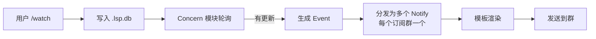

# 订阅源总览

DDBOT-WSa **master 分支**内置 9 个订阅源，覆盖主流直播/动态平台。也可通过插件扩展任意订阅源。

!!! info "next / next-dev 分支有更多订阅源"
    - `next` 分支：ACFun 新增动态类型、微博重构三模式、推特新增 api 模式
    - `next-dev` 分支：额外新增 **小红书**、**Twitch**、**小黑盒** 三个订阅源

    详见 [版本与分支](../deploy/branches.md)。

---

## 内置订阅源（master）

| 订阅源 | site | 类型 | 是否需配置 | 说明 |
|--------|------|------|-----------|------|
| [B 站](bilibili.md) | `bilibili` | live / news | 推荐 | 最常用，直播+动态 |
| [斗鱼](douyu.md) | `douyu` | live | 否 | 直播 |
| [虎牙](huya.md) | `huya` | live | 否 | 直播 |
| [ACFun](acfun.md) | `acfun` | live | 否 | 直播（next+ 支持动态） |
| [YouTube](youtube.md) | `youtube` | live / news | 视情况 | 直播+视频，国内需代理 |
| [微博](weibo.md) | `weibo` | news | 否 | 动态（next+ 三模式） |
| [TwitCasting](twitcasting.md) | `twitcasting` | live | 是 | 直播，需 App 凭证 |
| [推特](twitter.md) | `twitter` | news | 是 | WSa 新增，nitter 镜像（next+ 支持 api） |
| [抖音](douyin.md) | `douyin` | live | 是 | WSa 新增（测试） |

---

## 订阅类型

每个订阅源支持一种或多种 `type`：

| 类型 | 含义 | 适用 |
|------|------|------|
| `live` | 直播状态 | 开播/下播推送 |
| `news` | 动态/内容更新 | B 站动态、微博、YouTube 视频、推特 |

不指定 `-t` 时默认 `live`。

---

## 订阅机制

- **轮询**：每个订阅源有自己的 `interval`，按订阅列表依次轮询
- **去重**：同一更新只推送一次，不会重复
- **限流**：`concern.emitInterval` 控制全局刷新频率，`notify.parallel` 控制并发
- **模板**：每个订阅源有对应的推送模板，可自定义

---

## 通用配置

每个订阅源的推送行为可通过 `/config` 命令定制：

- `at_all` - @全体成员
- `at` - @特定成员
- `title_notify` - 标题变更推送
- `offline_notify` - 下播推送
- `filter` - 动态过滤（B 站）

详见 [配置命令](../commands/config-cmd.md)。

---

## 扩展订阅源

DDBOT 是一个通用推送框架，你可以通过编写插件接入任意订阅源：

- 实现 `Concern` 接口
- 在 `init()` 中注册
- 在 `main` 中引入包

详见 [插件开发](../plugin/index.md)。也提供了 [DDBOT-template](https://github.com/Sora233/DDBOT-template) 脚手架和 [DDBOT-example](https://github.com/Sora233/DDBOT-example) 示例。

---

## 下一步

- 选择左侧订阅源查看详细说明
- [订阅命令](../commands/subscribe.md) -- `/watch` 用法
- [推送模板](../template/notify-tmpl.md) -- 自定义推送格式
